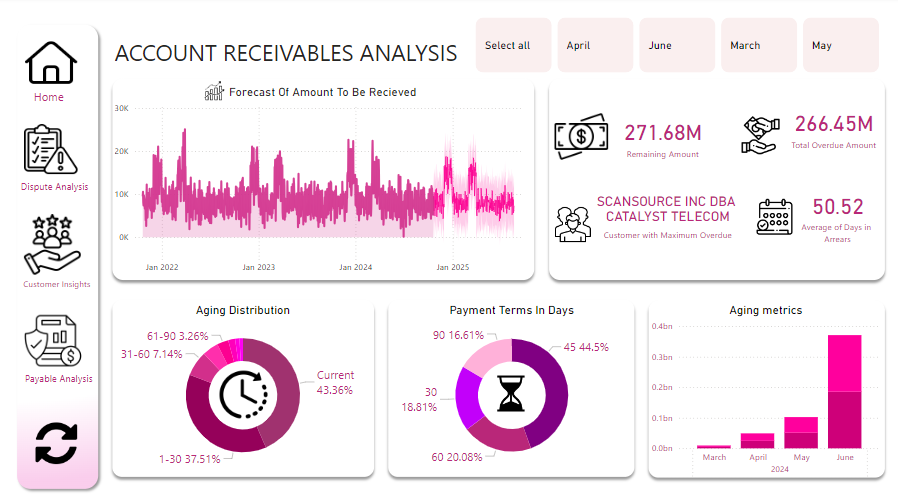
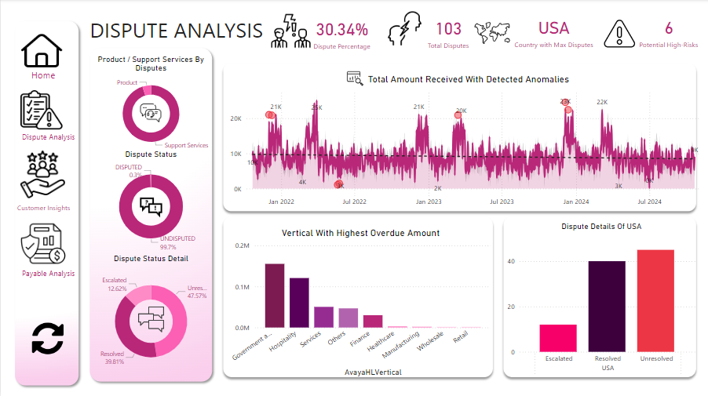
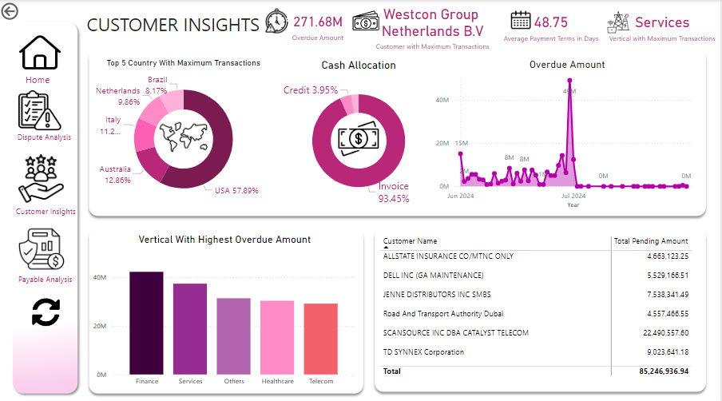
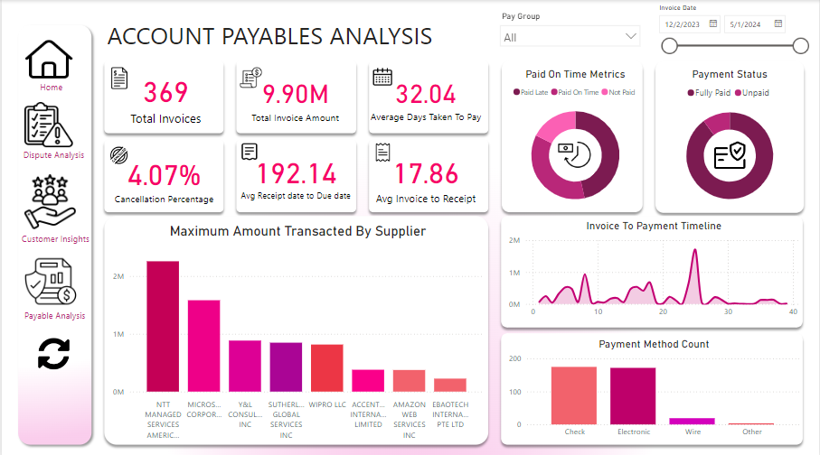

# Cashflow Analysis Dashboard - PowerBI

This PowerBI dashboard provides a complete view of cashflow activities, designed to help users understand the movement of money within a business and identify key financial patterns. The dashboard is structured into four main sections, each offering insights to help make informed financial decisions.

## Dashboard Sections

### 1. Overall Summary
   This section gives a snapshot of incoming payments (receivables) that the business expects to collect. It shows how these receivables are distributed over time, helping users understand which payments are overdue and need attention, versus those that are on time. Additionally, it highlights the different terms of payment agreements (like payments due in 30 days, 60 days, etc.), helping users see which agreements are most common and how they might impact cash inflow.

### 2. Dispute Analysis
   Here, users can explore details about financial disputes—situations where customers have raised issues with payments. This section categorizes disputes based on their current status, such as those that have been resolved, are in escalation, or are still unresolved. Users can also identify areas of potential risk, seeing the six major types of risks associated with these transactions. Additionally, the dashboard pinpoints geographical locations (such as countries) where disputes are most common, as well as business segments where irregularities or high dispute rates appear most frequently. This helps in understanding where to focus efforts for dispute resolution and risk management.

### 3. Customer Insights
   This part of the dashboard offers an in-depth look at customer activity. It highlights which customers have outstanding balances, meaning they owe payments to the business, and provides insights into overdue payments. By displaying customers with high pending amounts and the regions or types of business (verticals) associated with overdue amounts, users can prioritize collections. There’s also a focus on cash allocation—how funds are spread across customers or regions—helping the business assess where the cashflow is concentrated and whether adjustments are needed.

### 4. Payable Analysis
   In this section, users can explore details about the business’s payments to suppliers and service providers (payables). Key metrics include payment timelines, payment methods used, and trends in supplier transactions. For instance, users can see the average time it takes for payments to go from invoice creation to completion, identifying any delays that could impact supplier relationships. The dashboard also displays the most common payment methods and highlights suppliers with high transaction volumes, providing insights into areas where efficiencies can be introduced.

---

## Table of Contents
1. [Overview](#overview)
2. [Dashboard Sections](#dashboard-sections)
   - [Overall Summary](#overall-summary)
   - [Dispute Analysis](#dispute-analysis)
   - [Customer Insights](#customer-insights)
   - [Payable Analysis](#payable-analysis)
3. [Filters and Interactivity](#filters-and-interactivity)
4. [Key Metrics and Insights](#key-metrics-and-insights)

---

## Overview

This dashboard consolidates cashflow data to offer valuable insights on receivables, dispute trends, customer activity, and payables management. Designed for finance professionals, it allows for a high-level summary with drill-down capabilities across metrics. The interactive features and month-based filters enable targeted analysis.

## Dashboard Sections

### 1. Overall Summary
   In this section, we address the challenges businesses face with managing cash inflows from customers, ensuring timely collections, and maintaining healthy cashflow. By forecasting receivables and analyzing payment patterns, we provide actionable insights to address these common financial challenges.

   

   - **Forecasted Receivables**:  
     Organizations often struggle to predict cash inflows accurately, making it difficult to manage resources and plan for expenditures. Unexpected delays or shortfalls in expected receivables can disrupt operations and increase financial strain.  
     This dashboard provides a forecast of expected receivables within a specified time frame, offering visibility into upcoming cash inflows. By understanding projected collections, the business can prepare more effectively for future needs and make better-informed financial decisions.

   - **Aging Distribution**:  
     Overdue receivables are a common problem, often tied to customer payment delays. Organizations need a way to quickly identify overdue payments to prioritize collection efforts and minimize financial risk.  
     The aging distribution breakdown categorizes receivables based on age, highlighting overdue amounts and patterns. This enables the finance team to quickly pinpoint which accounts require immediate follow-up, helping reduce outstanding balances and improve overall cashflow.

   - **Payment Terms Distribution**:  
     With varying payment terms across customers, it can be challenging to predict cash inflows accurately. Longer payment terms can delay receivables, impacting liquidity.  
     By analyzing the distribution of payment terms, the dashboard provides insights into typical payment timelines and reveals how payment terms affect cash inflows. This helps the business understand which terms are most favorable and encourages proactive discussions with customers to optimize payment terms for better cashflow alignment.

   - **Filters**:  
     Businesses need to track cashflow trends over time and adjust strategies based on seasonal or cyclical patterns. Without monthly insights, it’s challenging to plan for variations in cashflow needs.  
     Month-based filters allow users to examine receivables, aging patterns, and cashflow trends on a monthly basis, helping the organization make informed adjustments to its financial planning. This targeted analysis ensures that the business can adapt strategies to align with real-time financial needs.

### 2. Dispute Analysis
   Disputes in financial transactions present significant challenges to organizations, affecting cashflow, customer relationships, and operational efficiency. This section helps businesses address these challenges by analyzing the nature, status, and risk level of disputes.
  
   - **Dispute Overview**:  
     Disputes can create delays in cashflow and affect the organization’s ability to accurately forecast revenue. Understanding the status of each dispute (whether it is escalated, resolved, or still unresolved) is essential to prioritize action and manage customer relationships.  
     This dashboard categorizes the total of 103 disputes by status—**Escalated**, **Resolved**, and **Unresolved**—and presents them in a segmented chart. By visualizing dispute status, finance teams can identify which cases need immediate action, which have been resolved, and how many remain unresolved, enabling efficient resolution and better customer service.

   - **Potential Risks**:  
     Transactions carry inherent risks, and organizations need to pinpoint specific risk types associated with disputes to mitigate financial exposure. Without a clear understanding of these risks, businesses may face recurring issues that impact cashflow.  
     The dashboard identifies six primary types of risks linked to transaction disputes and quantifies them for prioritization. This helps the finance team focus on high-impact risks and implement mitigation strategies, ultimately strengthening the company’s risk management framework.

   - **Anomaly Detection**:  
     Irregularities in disputes can go unnoticed and lead to larger financial losses if not addressed. Identifying anomalies early allows organizations to investigate unusual patterns and prevent potential fraud or systemic errors.  
     **Solution**: By flagging anomalies in dispute data, the dashboard assists in the early detection of irregularities. This anomaly detection feature allows the finance team to investigate unexpected patterns and take corrective action promptly, protecting the organization from potential financial risks.

   - **Geographic & Vertical Analysis**:  
     Disputes may be more prevalent in certain regions or business segments, yet identifying these trends manually is time-consuming. Without this knowledge, businesses risk missing out on insights that could drive tailored solutions.  
     The dashboard highlights countries with the highest dispute frequency, such as the USA, and visualizes disputes across business verticals. By pinpointing regions and sectors with elevated dispute rates, the organization can tailor its risk management strategies and customer engagement approaches to address specific areas of concern.

### 3. Customer Insights
   Effective customer management is crucial for maintaining steady cashflow and minimizing overdue balances. This section provides insights into customer transaction behavior, allowing the organization to address challenges related to cash collection, prioritization, and risk management.
   
  

  
   - **Customer Activity**:  
     Businesses often face difficulty tracking overdue balances and pending amounts for individual customers, which can hinder timely collections and impact cashflow. Identifying high-risk customers with outstanding balances is essential for focused collection efforts.  
     This dashboard provides a detailed view of customer transactions, highlighting customers with the highest pending amounts and overdue balances. By identifying customers with significant outstanding debts, finance teams can prioritize collections and improve cashflow management.

   - **Cash Allocation**:  
     Without clear visibility into how funds are distributed across customer accounts, businesses may struggle to optimize cash allocation strategies. Unbalanced cash allocation can create liquidity issues and limit financial flexibility.  
     This feature shows the allocation patterns of cash across various customers, helping the organization understand where funds are concentrated. By analyzing these patterns, finance teams can make strategic decisions to optimize cash allocation, ensuring a balanced distribution that supports ongoing financial stability.

   - **Regional and Vertical Breakdown**:  
     Customer behaviors and payment risks often vary by region and business segment. Tracking these variations manually can be challenging and may prevent the business from addressing specific areas with higher overdue amounts or risk levels.  
     This dashboard visualizes transaction volumes and overdue amounts across countries and business verticals, highlighting areas with high-value customers or elevated risk. By focusing on these regions and segments, the organization can prioritize collections, strengthen customer engagement, and apply targeted strategies to reduce overdue amounts in high-risk areas.

### 4. Payable Analysis
   Efficient management of payables is essential for maintaining healthy supplier relationships and optimizing cashflow. This section provides key insights into payment timelines, methods, and supplier performance, helping the organization address challenges associated with accounts payable.
  
   - **Payable Metrics**:  
     Monitoring the efficiency of payments and maintaining strong supplier relationships can be challenging without clear visibility into payment timelines and trends. Delays in payments can strain supplier partnerships and impact future transactions.  
     This dashboard presents essential metrics such as payment timelines, preferred payment methods, and other indicators that reflect the efficiency of accounts payable. By tracking these metrics, the organization can identify areas for improvement in payment processing, ensuring suppliers are paid on time and relationships remain positive.

   - **Invoice-to-Payment Timeline**:  
     Delays between invoice generation and payment can create operational inefficiencies and negatively impact supplier trust. Businesses need to pinpoint bottlenecks in their payment processes to reduce these delays.  
     The dashboard tracks the average time taken from invoice creation to payment completion, providing insights into any delays. By understanding this timeline, finance teams can address process inefficiencies and take steps to speed up payments, enhancing supplier satisfaction and maintaining a steady cashflow.

   - **Payment Methods and Supplier Transactions**:  
     Without tracking the most used payment methods or identifying top suppliers by transaction volume, it can be difficult to streamline payment processes and evaluate supplier performance effectively.  
     This feature highlights commonly used payment methods and identifies suppliers with the highest transaction volumes, helping the organization assess which payment methods work best and which suppliers are integral to operations. This insight enables finance teams to evaluate supplier performance more effectively and make data-driven decisions to improve payable processes.

## Key Metrics and Insights

1. **Forecasted Receivables**:  
   - **Insight**: In many industries, up to 40% of receivables can be delayed due to payment processing inefficiencies. By forecasting expected cash inflows, this metric allows businesses to anticipate incoming revenue and prepare for any gaps in cashflow. Organizations with effective receivables forecasting can reduce cashflow unpredictability and strengthen their ability to plan for upcoming expenses.

2. **Aging Distribution**:  
   - **Insight**: Studies show that as receivables age, the likelihood of collection decreases dramatically, with a 50% drop in collection likelihood after 90 days. The aging distribution metric provides a breakdown of receivables by age, highlighting overdue payments. This helps finance teams prioritize collections on high-risk accounts, reducing the chances of long-term overdue debts and improving liquidity.

3. **Dispute Categorization**:  
   - **Insight**: Disputes are common, with up to 5-10% of all B2B transactions resulting in some form of dispute. Categorizing disputes by type and status helps teams efficiently allocate resources to resolve issues, mitigate potential losses, and maintain strong customer relationships. This metric allows finance teams to focus on high-priority disputes (e.g., escalated or unresolved) and streamline the resolution process.

4. **Anomaly Detection**:  
   - **Insight**: Research indicates that undetected anomalies, such as errors or fraudulent transactions, can cost companies up to 5% of their annual revenue. This metric flags irregularities in dispute and payment data, enabling quick investigation and intervention. By identifying anomalies early, businesses can minimize financial risk, prevent potential fraud, and maintain data integrity.

5. **Customer Payment Activity**:  
   - **Insight**: In many industries, the top 20% of customers can account for up to 80% of overdue balances. This metric identifies key customers with significant overdue balances, allowing finance teams to focus collection efforts where they matter most. By prioritizing high-value overdue accounts, organizations can accelerate cash recovery and enhance financial stability.

6. **Invoice-to-Payment Timeline**:  
   - **Insight**: The average invoice-to-payment time for businesses can range from 30 to 60 days, with delays affecting supplier relationships and operational efficiency. Tracking the average time from invoice generation to payment completion helps assess the efficiency of the payable process. Businesses that optimize their invoice-to-payment timeline are better positioned to maintain healthy supplier relationships and improve cashflow predictability.

---

## Conclusion

The Cashflow Analysis Dashboard offers actionable insights for managing receivables, mitigating dispute risks, optimizing cash allocation, and improving payables. With its interactive filters and detailed metrics, this tool empowers finance professionals to make data-driven decisions for better cashflow management.
